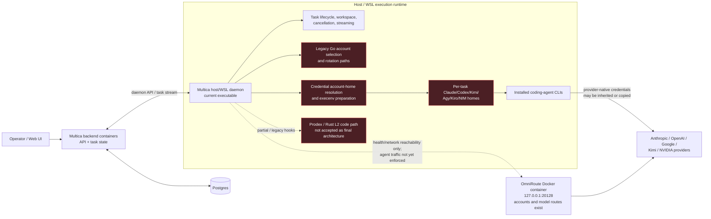
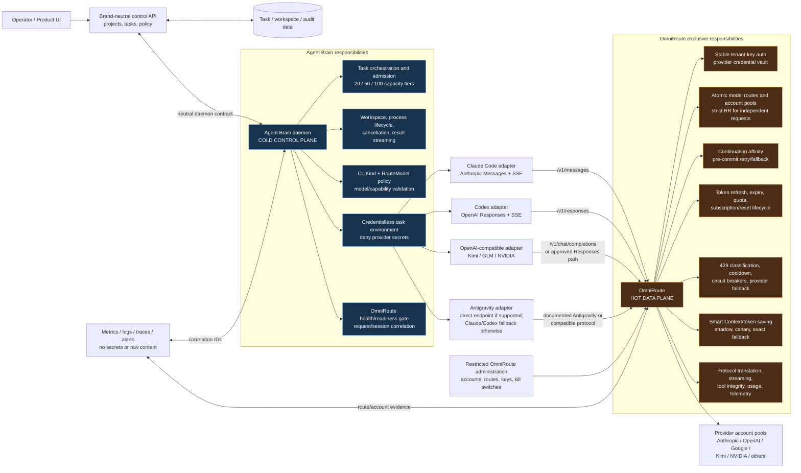
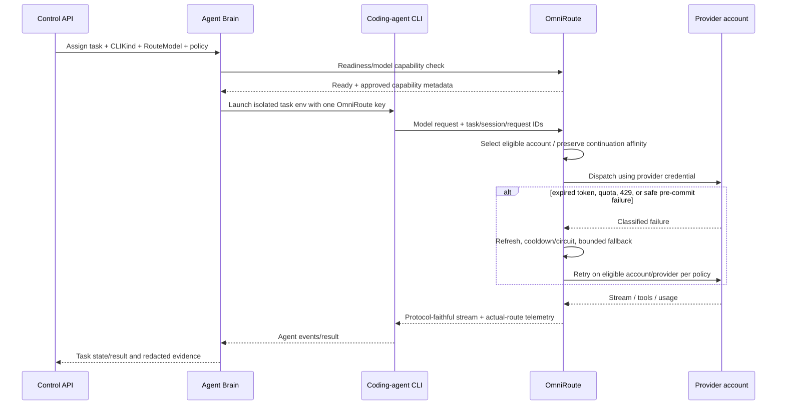

# Agent Brain and OmniRoute Architecture

## Scope

These diagrams describe the discovered runtime today and the target boundary. They intentionally distinguish the Docker backend from the host/WSL daemon that actually launches coding-agent CLIs.

## AS-IS: discovered current runtime

### Current-state facts and risks

- The active daemon runs on the WSL/host and launches host-installed CLIs. The `multica-backend-1` container is not the CLI runtime.
- For this daemon, OmniRoute is reached through `http://127.0.0.1:20128`; Docker DNS `http://omniroute:20128` applies only to containers on `multica_default`.
- OmniRoute is alive and has account pools/model routes, but the active daemon environment does not yet enforce OmniRoute base URLs or the single stable key.
- Existing execution code can copy native credentials into task homes and can inherit provider secrets from the daemon environment.
- Custom agent environment settings can currently override routing/authentication variables unless gateway-required mode applies a denylist and injects trusted values last.
- Prodex/L2 and legacy rotation hooks remain in the source, but they are superseded by the target design and must not remain an alternative credential/router owner.

## TO-BE: brand-neutral Agent Brain plus OmniRoute

## Target responsibility boundary

| Responsibility | Agent Brain | OmniRoute |
|---|---|---|
| Product tasks, workspaces, repositories, processes | Owns | Does not own |
| Task admission and 20/50/100 concurrency tiers | Owns task-level admission | Owns inference/account-level limits and queues |
| CLI installation, launch, cancellation, stdout/event parsing | Owns | Does not own |
| Provider/model selection intent | Sends approved route/model ID | Validates and resolves route/model |
| Provider credentials and subscriptions | Must never possess | Exclusive owner |
| Account selection and strict round-robin | Must not duplicate | Exclusive owner |
| Continuation/account affinity | Supplies opaque session/continuation IDs | Enforces required hot-path affinity |
| Token refresh, expiry, quota, reset/redeem | Observes safe status only | Exclusive owner |
| 429/5xx retry, circuit breaker, account/provider fallback | Sets policy/deadline; no account retry | Executes bounded pre-commit policy |
| Protocol translation and SSE/tool fidelity | Configures correct CLI adapter | Preserves or explicitly rejects capability |
| Smart Context/token saving | Chooses policy/kill switch only | Computes, validates, and performs hot-path optimization |
| Provider usage/cost evidence | Aggregates by task/project | Produces redacted route/model/account usage evidence |
| Secrets in logs/traces | Redacts stable key and content | Redacts stable/provider secrets and content |
| Product kill switch | Can stop tasks or disable route policy | Stops route/account/model before next request |

## Required request flow

## Non-negotiable cutover rules

1. The Agent Brain must fail closed when OmniRoute is not ready; it must not fall back to direct provider credentials.
2. Trusted gateway configuration is injected after user/custom environment processing, and provider-native keys/base URLs are denied.
3. Strict round-robin applies to new independent requests. Stateful continuations are explicitly affinitized; SSE chunks and internal retries never advance rotation as new logical requests.
4. Rotation policy never creates a global one-request-at-a-time limit. Account/model/global concurrency and admission are separately configurable.
5. No mid-stream replay after partial model output or a potentially non-idempotent tool action.
6. Prodex is removable only after the feature-parity matrix and OmniRoute acceptance checklist are complete with evidence.
7. Legacy Multica names remain only in a time-bounded compatibility facade until API, CLI, stored configuration, and UI consumers migrate.
